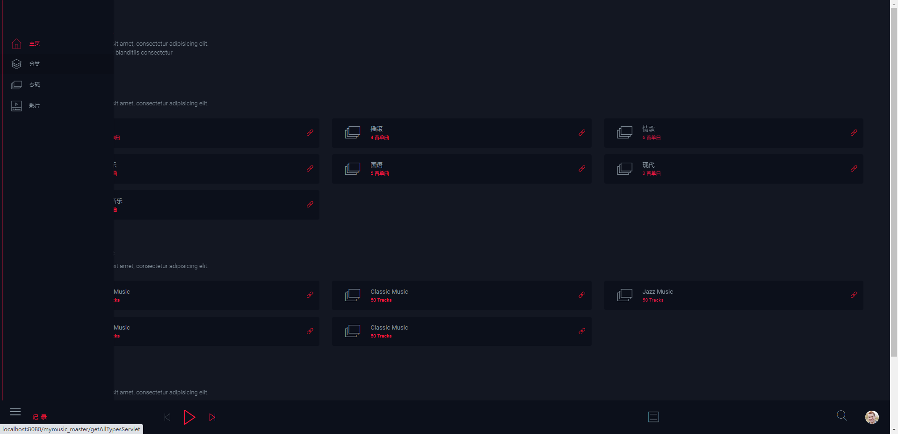
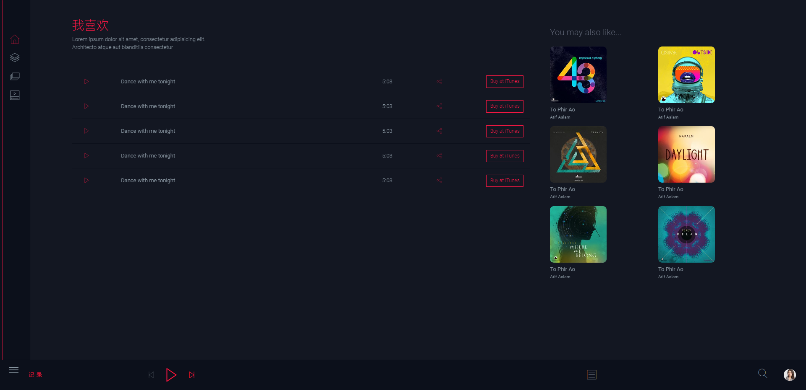
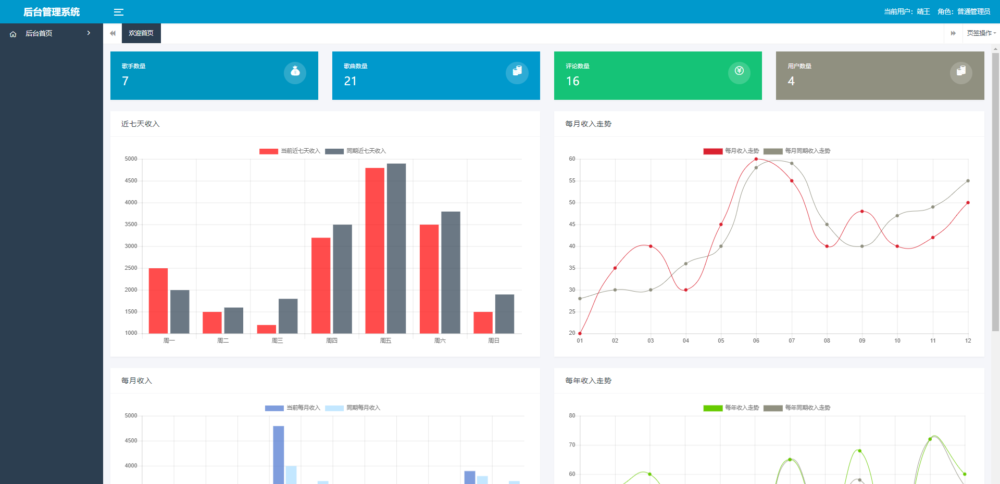
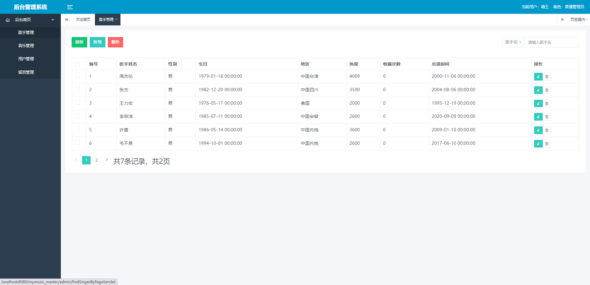
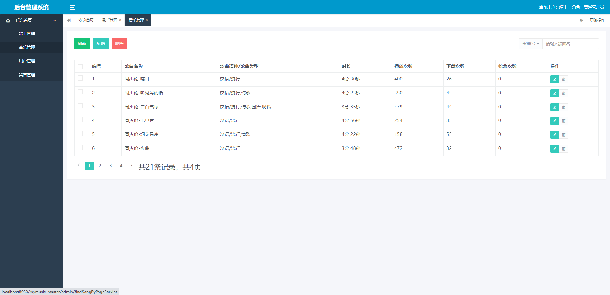
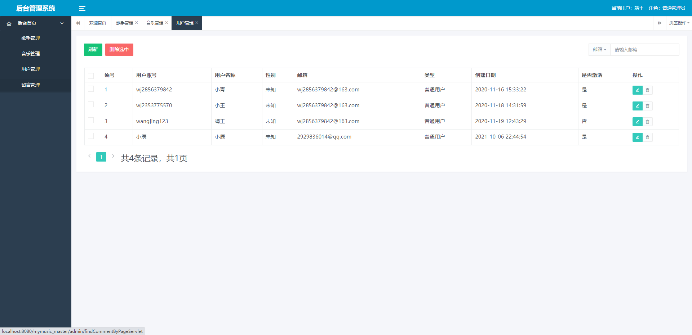
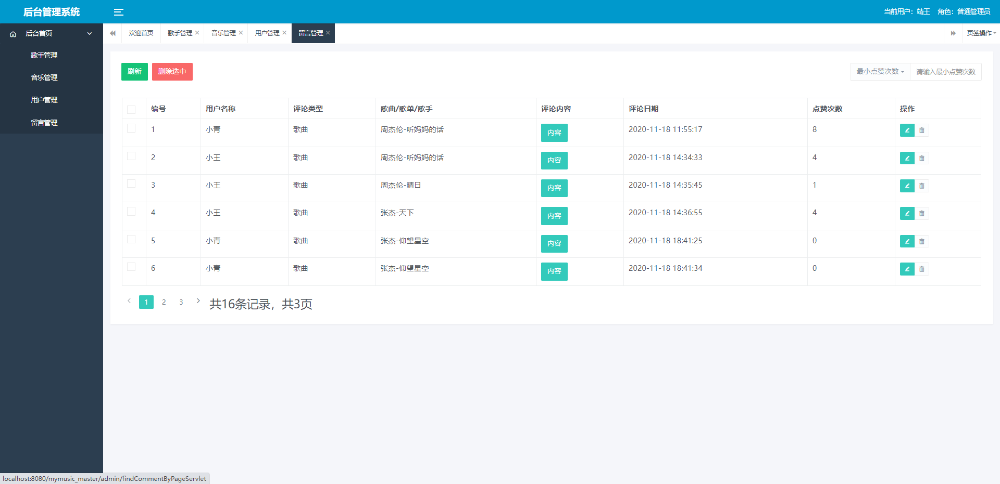

## 基于JSP+Servlet实现的个人音乐网站系统

- <b>完整代码获取地址：从戎源码网 ([https://armycodes.com/](https://armycodes.com/))</b>
- <b>技术探讨、资料分享，请加QQ群：692619798</b> 
- <b>作者微信：19941326836  QQ：952045282</b> 
- <b>承接计算机毕业设计、Java毕业设计、Python毕业设计、深度学习、机器学习</b>
- <b>选题+开题报告+任务书+程序定制+安装调试+论文+答辩ppt 一条龙服务</b>
- <b>所有选题地址 ([https://github.com/YuLin-Coder/AllProjectCatalog](https://github.com/YuLin-Coder/AllProjectCatalog)) </b>

## 项目介绍
基于JSP+Servlet实现的个人音乐网站系统，分为用户和管理员两个角色，主要功能如下

【前台功能】
1. 首页展示：展示网站的整体风格和音乐推荐等内容，吸引用户进入网站。
2. 音乐分类：将音乐按照不同的分类进行展示，如热门音乐、新歌推荐、流行榜单等，
3. 歌手详情：提供歌手的详细信息和歌曲列表，用户可以了解歌手的背景和作品。
4. 播放音乐：用户可以点击音乐列表中的歌曲进行在线播放，包括播放、暂停、上一曲、下一曲等功能。
5. 搜索功能：提供音乐和歌手的搜索功能，用户可以根据关键词搜索自己感兴趣的音乐或歌手。
6. 用户注册和登录：用户可以通过注册账号并登录来获得更多个性化功能，如收藏音乐、评论歌曲等。
7. 用户个人中心：用户可以在个人中心中管理自己的账号信息、收藏的音乐、评论的歌曲等。
8. 用户评论和留言：用户可以在歌曲详情页进行评论和留言，与其他用户进行交流和分享观点。
9. 音乐分享：用户可以将自己喜欢的音乐分享到社交平台，让更多人了解和欣赏。
10. 在线购票：如果网站提供音乐演出的门票销售服务，用户可以在线购买演出门票。

【后台功能】
首页：显示歌手数量、歌曲数量、评论数量、用户数量、收入
歌手管理：实现歌手信息的增删改查功能，包括歌手姓名、歌手性别、歌手图片等。
音乐管理：实现音乐信息的增删改查功能，包括音乐名称、歌手姓名、音乐文件等。
留言管理：实现用户留言的管理功能，包括留言内容、留言时间、留言用户等。
用户管理：实现用户信息的管理功能，包括用户注册、登录、修改密码、个人信息管理等。

## 项目技术
- 编程语言：Java
- 数据库：MySQL
- 项目管理工具：Maven
- 前端技术：JSP、bootstrap、JQuery
- 后端技术：Servlet、JDBC

## 运行环境
- JDK版本：JDK1.8及以上
- 开发工具：IDEA、Ecplise、Myecplise都可以
- 数据库: MySQL5.7及以上
- Maven：maven3.0及以上

## 运行截图

